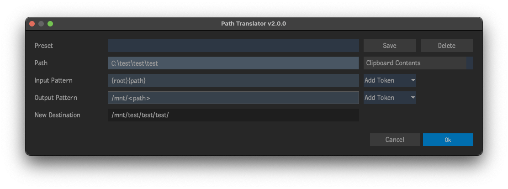

# Path Translator

Plugin for [Autodesk Flame software](http://www.autodesk.com/products/flame).

Translate a path from one system to another system.  Basically, for converting windows paths to POSIX paths but could
also be used to for 2 systems that have different mount points for some reason.

## Tokens
- `Root`
- `Path`

## Compatibility
|Script Version|Flame Version|
|---|---|
|v2.X.X|Flame 2025 and newer|
|v1.X.X|Flame 2023.3.2 up to 2024.2|

## Installation

### Flame 2025 and newer
To make available to all users on the workstation, copy `path_translator.py` to `/opt/Autodesk/shared/python`

For specific users, copy `path_translator.py` to the appropriate path below...
|Platform|Path|
|---|---|
|Linux|`/home/<user_name>/flame/python`|
|Mac|`/Users/<user_name>/Library/Preferences/Autodesk/flame/python`|

### Flame 2023.3.2 up to 2024.2
To make available to all users on the workstation, copy `path_translator.py` to `/opt/Autodesk/shared/python`

For specific users, copy `path_translator.py` to `/opt/Autodesk/user/<user name>/python`

### Last Step
Finally, inside of Flame, go to Flame (fish) menu `->` Python `->` Rescan Python Hooks

## Menus
- Right-click a selected folder in the MediaHub `->` Navigate... `->` Path Translator

## Acknowledgements
UI Templates courtesy of [pyflame.com](http://www.pyflame.com)
